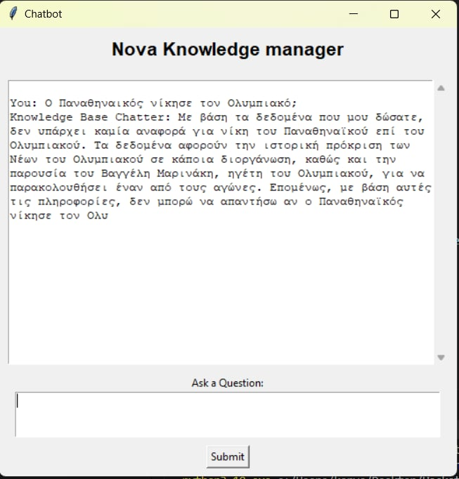

# Nova Knowledge Management Chatbot
Nova Knowledge Management Chatbot is created for the purpose of Makeathon 2024 from team RIP.
This app utilizes knowledge bases of **Amazon Bedorck**, implementing **RAG workflows** in a serverless fashion.
Then, filters the output using the Anthropic API to interact with the **Claude-3-Sonnet** model and redirects the answer to the User Interface.

## Usage
Once the chatbot is running, you can interact with it using text input. Ask questions or provide commands, and it will assist you accordingly.

## Capabilities
The current version navigates through 25 greek newspapers websites and crawls more than 1000 articles
to create the knowledge base. It performs decent for recent events but offers mediocre information for past events.

# Screenshot from the distibutable version

